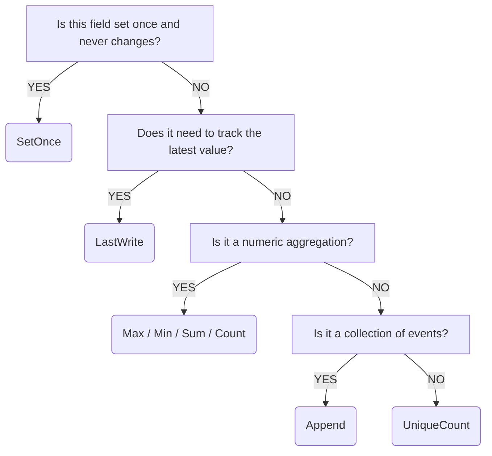

Population strategies define how an entity's state is updated when new data arrives from the blockchain. Choosing the right strategy is critical for ensuring your projected state accurately reflects the underlying on-chain activity.

## What are Population Strategies?

When a Hyperstack handler processes a transaction or account update, it maps data from the source (e.g., an Anchor instruction or a Protobuf event) into your entity's fields. A **Population Strategy** determines how that incoming value interacts with the existing value in that field.

For example, should a "Total Volume" field be overwritten by the latest trade amount, or should the latest amount be added to the current total? Strategies answer this question.

## Strategy Selection Guide

Use this decision tree to identify the correct strategy for your field.



### Quick Reference Table

| Strategy      | Behavior                              | Best For                             |
| :------------ | :------------------------------------ | :----------------------------------- |
| `LastWrite`   | Overwrites with newest data (Default) | Balances, Status, Current Prices     |
| `SetOnce`     | Only sets if field is empty           | IDs, Creation Timestamps, Owners     |
| `Sum`         | Adds incoming value to current        | Volume, Total Rewards, TVL           |
| `Count`       | Increments by 1                       | Trade Count, User Count, Event Count |
| `Append`      | Adds to an array/list                 | Trade History, Activity Logs         |
| `Max` / `Min` | Tracks the peak/trough                | High/Low Prices, Peak Liquidity      |
| `UniqueCount` | Counts distinct occurrences           | Active Users, Unique Voters          |
| `Merge`       | Merges keys in an object              | Configuration, Metadata              |

---

## Detailed Reference

### LastWrite (Default)

The most common strategy. Whenever a new value arrives, it completely replaces the previous one.

- **Use Case**: Tracking the current state of an account.
- **Example**:
  ```rust
  #[map(from = "TokenAccount", field = "amount", strategy = LastWrite)]
  pub balance: u64,
  ```

### SetOnce

The field is populated only once. Subsequent updates for the same entity will ignore this mapping if the field already has a value.

- **Use Case**: Immutable properties or "First Seen" metadata.
- **Example**:
  ```rust
  #[map(from = "Market", field = "initializer", strategy = SetOnce)]
  pub creator: Pubkey,
  ```

### Sum

Numeric values are added to the existing value. This is the foundation of tracking volume and throughput.

- **Use Case**: Financial metrics and cumulative totals.
- **Example**:
  ```rust
  #[aggregate(from = "Swap", field = "amount_in", strategy = Sum)]
  pub total_volume: u64,
  ```

### Count

Ignores the incoming value and simply increments the field by 1 for every match.

- **Use Case**: Tracking throughput or frequency.
- **Example**:
  ```rust
  #[aggregate(from = "Trade", strategy = Count)]
  pub trade_count: u64,
  ```

### Append

Adds the incoming value to a list. Use this to maintain a linear history of events within an entity.

- **Use Case**: Event logs, audit trails.
- **Example**:
  ```rust
  #[event(from = "Liquidate", strategy = Append)]
  pub liquidation_history: Vec<LiquidationEvent>,
  ```

### Max / Min

Keeps the highest or lowest value seen across all updates.

- **Use Case**: 24h Highs/Lows, price discovery.
- **Example**:
  ```rust
  #[aggregate(from = "OracleUpdate", field = "price", strategy = Max)]
  pub all_time_high: u64,
  ```

### UniqueCount

Maintains a set of unique values internally but projects only the count of that set.

- **Use Case**: Tracking "Active Users" or unique participants.
- **Example**:
  ```rust
  #[aggregate(from = "Vote", field = "voter", strategy = UniqueCount)]
  pub total_unique_voters: u32,
  ```

### Merge

Used for object-like fields where you want to update specific keys without blowing away the entire object.

- **Use Case**: Dynamic configuration maps.
- **Example**:
  ```rust
  #[map(from = "Config", strategy = Merge)]
  pub metadata: Map<String, String>,
  ```

---

## Common Patterns

### Token Price tracking

| Field           | Strategy    | Why                                                |
| :-------------- | :---------- | :------------------------------------------------- |
| `current_price` | `LastWrite` | You only care about the most recent oracle update. |
| `day_high`      | `Max`       | Tracks the peak price seen in the stream.          |
| `daily_volume`  | `Sum`       | Every swap adds to the total.                      |

### Governance tracking

| Field           | Strategy      | Why                                  |
| :-------------- | :------------ | :----------------------------------- |
| `total_votes`   | `Sum`         | Sum of vote weights.                 |
| `voter_count`   | `UniqueCount` | Count unique public keys that voted. |
| `first_vote_at` | `SetOnce`     | Record when the first vote was cast. |

## Common Mistakes to Avoid

1. **Summing non-numeric types**: `Sum` only works on integers and floats. Applying it to a `Pubkey` or `String` will result in a compilation error.
2. **Using LastWrite for Volume**: If you use `LastWrite` for a volume field, it will only show the amount of the _most recent_ trade, not the total.
3. **Appending unnecessarily**: `Append` grows the size of your entity state. Avoid appending thousands of items to a single entity if you only need the latest state; use a separate stream or specific aggregations instead.
4. **Forgetting the Default**: If you don't specify a strategy, `LastWrite` is used. Always explicitly state the strategy for aggregations to ensure clarity.
